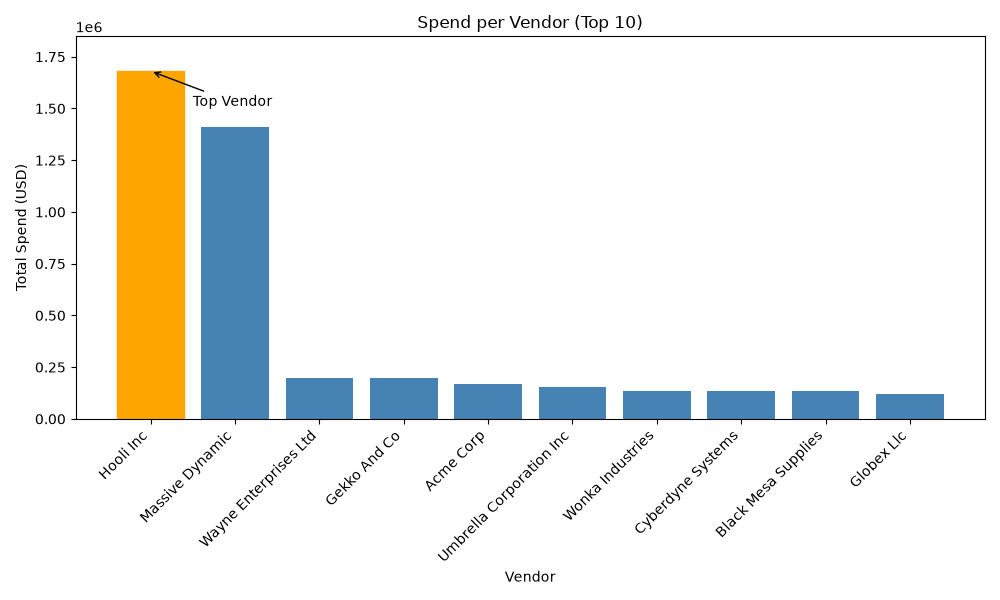
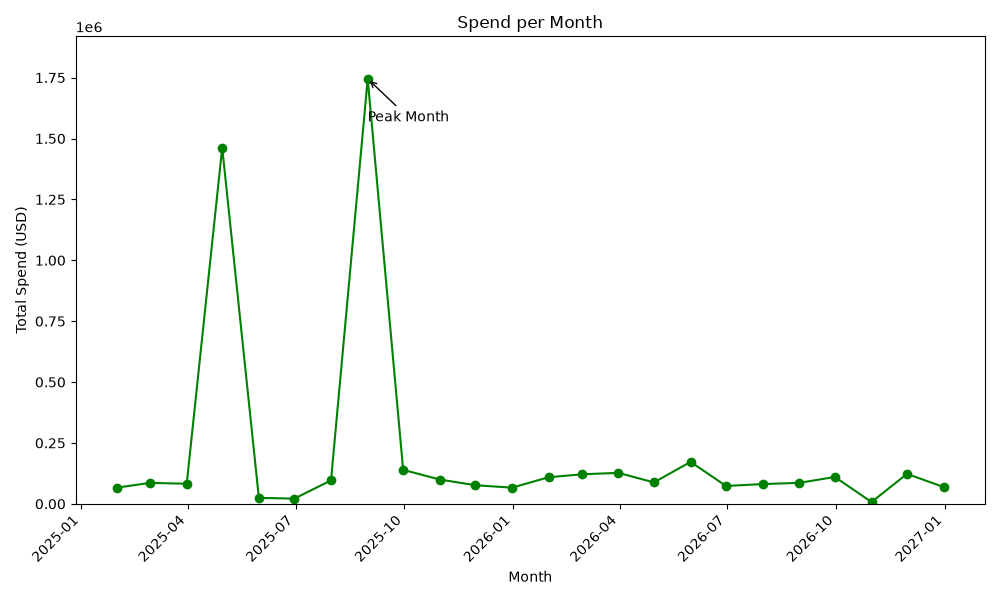

# 📄 Invoice Q&A and Insights


An end-to-end AI-powered invoice processing system that transforms raw invoice PDFs into structured, searchable, and analytics-ready data using a local Large Language Model (LLM), semantic search, and Retrieval-Augmented Generation (RAG). The project combines intelligent extraction, robust validation, data cleaning, and business analytics to deliver reliable insights while minimizing hallucinations through prompt engineering and faithfulness guardrails.

---

## 📚 Table of Contents

- [Features](#-features)
- [System Workflow](#-system-workflow)
- [Tech Stack](#-tech-stack)
- [Project Structure](#-project-structure)
- [Installation & Setup](#-installation--setup)
- [Running the Project](#-running-the-project)
- [Task Completion Summary](#-task-completion-summary)
- [Testing](#-testing)
- [Limitations](#-limitations)
- [Future Work](#-future-work)
- [Contributing](#-contributing)
- [License](#-license)

---

# ✨ Features

- 🤖 **Local LLM-based Invoice Extraction** using **Qwen2.5-0.5B-Instruct**
- 🔄 **Multi-stage extraction pipeline** with retry and regex fallback
- 📋 **Pydantic validation** for structured invoice data
- 🎯 **Prompt evaluation** using a ground-truth dataset
- 🔍 **Semantic invoice search** powered by ChromaDB and Sentence Transformers
- 💬 **Retrieval-Augmented Question Answering (RAG)** with source citations
- 🛡 **Faithfulness guardrails** to reduce hallucinations and unsupported answers
- 🧹 **Automated data cleaning** including vendor normalization, duplicate removal, and USD conversion
- 📊 **Business analytics** with statistical summaries and visualization charts
- ✅ **Automated testing** for retrieval and QA components

---

# 🔄 System Workflow

The project follows a modular pipeline where each stage prepares data for the next.

```text
                Invoice PDFs
                     │
                     ▼
          PDF Text Extraction
                     │
                     ▼
        Local LLM Information Extraction
                     │
        ┌────────────┴────────────┐
        ▼                         ▼
 Retry with Feedback       Regex Fallback
        │                         │
        └────────────┬────────────┘
                     ▼
          Structured Invoice Data
                     │
        ┌────────────┴────────────┐
        ▼                         ▼
   Data Cleaning           Vector Indexing
        │                         │
        └────────────┬────────────┘
                     ▼
       Retrieval-Augmented QA
                     │
                     ▼
      Analytics & Visualization
```

---

# ⚙️ Tech Stack

| Category | Technology |
|----------|------------|
| **Language** | Python 3.12+ |
| **LLM** | Qwen2.5-0.5B-Instruct |
| **Embeddings** | all-MiniLM-L6-v2 |
| **Vector Database** | ChromaDB |
| **Validation** | Pydantic |
| **PDF Processing** | pdfplumber |
| **Data Processing** | Pandas, NumPy |
| **Visualization** | Matplotlib |
| **Testing** | pytest |
| **Package Management** | uv |

---

# 📂 Project Structure

```text
Project_3/
│
├── app/
│   ├── llm.py
│   ├── extractor.py
│   ├── retriever.py
│   ├── qa.py
│   ├── cleaner.py
│   ├── analytics.py
│   ├── charts.py
│   └── ...
│
├── scripts/
├── tests/
├── data/
├── results/
├── pyproject.toml
├── README.md
└── .gitignore
```

---

# 🚀 Installation & Setup

## 📋 Prerequisites

Before running the project, ensure you have the following installed:

- Python **3.12+**
- Git
- **uv** *(recommended)* or **pip**
- At least 2 GB of available memory for the Qwen model.

---

## 📥 Clone the Repository

```bash
git clone <your-repository-url>
cd Project_3
```

---

## 📦 Install Dependencies

### Using uv (Recommended)

```bash
uv sync
```

### Using pip

```bash
python -m venv .venv

# Windows
.venv\Scripts\activate

pip install -e .
```

---

> ℹ️ **First‑run downloads:**  
> The project automatically downloads two models on first use:  
> - Qwen2.5‑0.5B‑Instruct (~1 GB)  
> - all‑MiniLM‑L6‑v2 (~90 MB)  
> This may take a few minutes depending on your internet connection. Subsequent runs use the cached models.

## 🔑 Configure Environment Variables

Optionally set your Hugging Face token to avoid model download rate limits.

### Windows PowerShell

```powershell
$env:HF_TOKEN="YOUR_HUGGINGFACE_TOKEN"
```

No additional configuration is required.

---

## 📂 Prepare the Dataset

Place your invoice PDF files inside:

```text
data/invoices_corpus/
```

(Optional) Generate a ground truth template for prompt evaluation:

```bash
python scripts/generate_ground_truth_template.py
```

Create an exchange rate file at:

```text
data/exchange_rates.csv
```

Example:

```csv
currency,rate_to_usd
USD,1.0
GBP,1.27
EUR,1.08
INR,0.012
```

---

## ⚡ Quick‑Start Demo

Verify the core pipeline in five minutes without processing all invoices:

```bash
# Test the LLM (first run downloads ~1 GB model)
python app/llm.py "Reply with the word PONG"

# Extract a sample invoice (built‑in example inside extractor.py)
python -m app.extractor

# Ask a question (vector index must already exist)
python -c "from app.qa import ask; print(ask('What is the total amount on invoice INV-24990?'))"

---

# ▶️ Running the Project

Follow the steps below to execute the complete invoice processing pipeline.

### 1️⃣ Pre-extract PDF Text *(Optional)*

```bash
python scripts/pre_extract_text.py
```

---

### 2️⃣ Build the Vector Index

```bash
python scripts/build_index.py
```

---

### 3️⃣ Extract Invoice Data (Full Pipeline)

```bash
python scripts/run_extraction.py
```

⚠️ Important: The extraction script loads the Qwen model and holds it in memory.

Do not run other LLM processes (tests, QA, prompt evaluation) at the same time – they will crash due to memory contention.

Extraction of 500+ invoices may take several hours on CPU.

This processes every invoice through:

```text
LLM Extraction
      │
      ▼
Validation
      │
Retry (if required)
      │
Regex Fallback
      │
      ▼
Structured Invoice Data
```

---

### 4️⃣ Clean the Dataset

```bash
python -m app.cleaner
```

This step performs:

- Vendor normalization
- Date parsing
- USD conversion
- Duplicate removal
- Line-item mismatch detection

---

### 5️⃣ Generate Analytics

```bash
python -m app.analytics
```

---

### 6️⃣ Generate Charts

```bash
python -m app.charts
```

Generated outputs include:

- 📊 Vendor Spend Chart
- 📈 Monthly Spend Chart

---

### 7️⃣ Ask Questions

```python
from app.qa import ask

result = ask("What is the total amount on invoice INV-24990?")
print(result)
```

Example output:

```text
Answer : 13082.48 GBP

Source : INV-24990
```

---

# 🧑‍💻 Development Workflow

The recommended workflow for working on this project is shown below.

```text
Invoice PDFs
      │
      ▼
Extract Text
      │
      ▼
LLM Extraction
      │
      ▼
Prompt Evaluation
      │
      ▼
Build Vector Index
      │
      ▼
Question Answering
      │
      ▼
Data Cleaning
      │
      ▼
Analytics & Charts
      │
      ▼
Run Tests
```

---

## 📌 Running Individual Modules

| Task                 |                                        Command |
|----------------------|------------------------------------------------|
| Test LLM             | `python app/llm.py "Reply with the word PONG"` |
| Extraction Demo      | `python -m app.extractor`                      |
| Prompt Evaluation    | `python -m app.prompt_evaluation`              |
| Failure Analysis     | `python -m app.failure_analysis`               |
| QA Prompt Evaluation | `python -m app.qa_evaluation`                  |
| Run Tests            | `uv run pytest tests/ -v`                      |

---

---

# 📋 Task Completion Summary

The project was completed through **9 major implementation tasks**, each contributing to the end-to-end invoice intelligence pipeline.

| Task | Description | Status |
|------|-------------|:------:|
| **1** | Implemented a local LLM wrapper with deterministic generation, logging, and unified error handling. | ✅ |
| **2** | Built a robust invoice extraction pipeline using LLM → Retry → Regex fallback with Pydantic validation. | ✅ |
| **3** | Evaluated multiple extraction prompts against a ground-truth dataset and selected the best-performing prompt. | ✅ |
| **4** | Performed hard-case analysis on challenging invoices and established trust-or-fallback rules. | ✅ |
| **5** | Developed a semantic search system using embeddings and ChromaDB with metadata filtering. | ✅ |
| **6** | Implemented Retrieval-Augmented Question Answering (RAG) with source citations and faithfulness checks. | ✅ |
| **7** | Evaluated QA prompts based on answer accuracy and refusal rate, retaining the best version. | ✅ |
| **8** | Built a data cleaning pipeline including vendor normalization, duplicate removal, currency conversion, and validation checks. | ✅ |
| **9** | Generated statistical insights and honest visualizations including vendor spending and monthly trends. | ✅ |

---

# 🧪 Testing

The project uses **pytest** to validate the retrieval and question-answering components.
Stop any running extraction before executing the test suite.

## Run Tests

```bash
uv run pytest tests/ -v
```

### Current Test Results

```text
tests/test_search.py::test_search_returns_4_results PASSED
tests/test_qa.py::test_answerable_question PASSED
tests/test_qa.py::test_unanswerable_question PASSED

==========================
3 passed in X.XXs
==========================
```

---

# 📊 Generated Outputs

Running the complete pipeline produces:

```text
results/
├── prompt_scores.csv
├── failures.csv
├── qa_scores.csv
├── clean_invoices.csv
├── vendor_spend.png
└── monthly_spend.png
```

### Sample Charts

| Vendor Spend (Top 10)                     | Monthly Spend                              |
|-------------------------------------------|--------------------------------------------|
|  |  |

---

# ⚠️ Limitations

Although functional, the project has a few known limitations:

- Small **Qwen2.5-0.5B** model may occasionally produce inaccurate or incomplete extractions.
- Image-only (scanned) PDFs are not supported since OCR is not integrated.
- Currency conversion relies on fixed exchange rates provided by the user.
- Line-item mismatches are detected but not automatically corrected.
- Retrieval and QA quality depend on the embedding model and retrieved context.
- ChromaDB is suitable for medium-sized datasets; larger deployments may require a production-grade vector database.

---

## 🛠 Troubleshooting

| Symptom | Probable Cause | Solution |
|---------|----------------|----------|
| `Windows fatal exception: access violation` when running tests or QA | Multiple processes are trying to load the Qwen model simultaneously (e.g., extraction + tests). | Stop any running extraction (`Ctrl+C`), wait a moment, then re‑run the test or QA command. Only one LLM‑using process at a time on CPU. |
| `ModuleNotFoundError: No module named 'app'` | Virtual environment not activated. | Activate it: `.venv\Scripts\activate` (Windows) or `source .venv/bin/activate` (Linux/macOS). Then re‑run the command. |
| Extraction returns mostly empty fields | The invoice may be a scanned image with no embedded text. | Use an OCR tool (e.g., Tesseract) to extract text before feeding it to the extraction pipeline. |
| ChromaDB index count grows on every `build_index.py` run | The chunk IDs are not stable (e.g., using file‑stem instead of invoice number). | Verify that `invoice_number` metadata is correctly mapped from `ground_truth.csv`. See the indexing logic in `app/retriever.py`. |

---

# 🚀 Future Work

Potential improvements for future versions include:

- [ ] OCR support for scanned invoices
- [ ] Upgrade to a larger or fine-tuned LLM
- [ ] Live exchange-rate API integration
- [ ] FastAPI backend for REST endpoints
- [ ] Interactive dashboard for analytics
- [ ] Docker support
- [ ] CI/CD with GitHub Actions
- [ ] Hybrid keyword + semantic search
- [ ] Export reports to Excel or PDF

---

# 🤝 Contributing

Contributions are welcome!

1. Fork the repository.
2. Create a new feature branch.
3. Commit your changes with meaningful messages.
4. Ensure all tests pass.
5. Open a Pull Request for review.

Example commit messages:

```text
feat: add OCR preprocessing

fix: improve regex fallback extraction

docs: update README

test: add QA evaluation tests
```

---

## 🙏 Acknowledgements

This project was built using several excellent open-source tools and libraries:

- Qwen2.5-0.5B-Instruct
- Hugging Face Transformers
- Sentence Transformers
- ChromaDB
- PyTorch
- Pydantic
- pdfplumber
- Pandas
- NumPy
- Matplotlib
- pytest